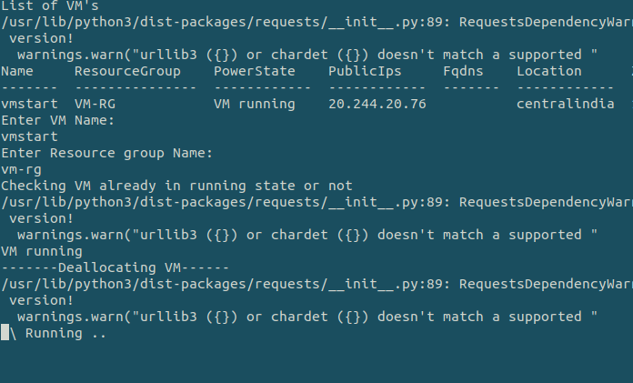
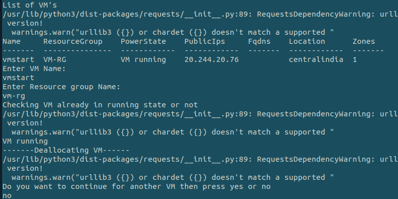
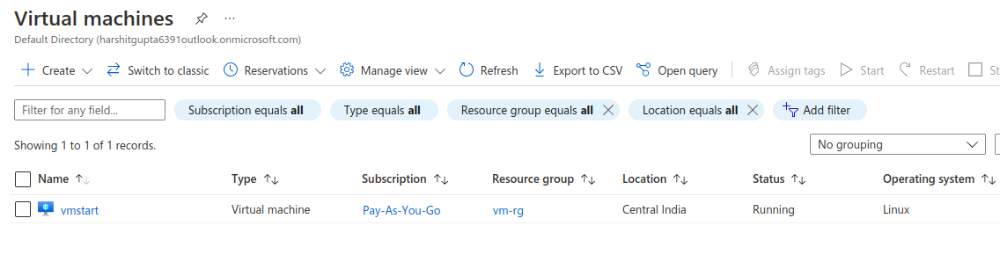
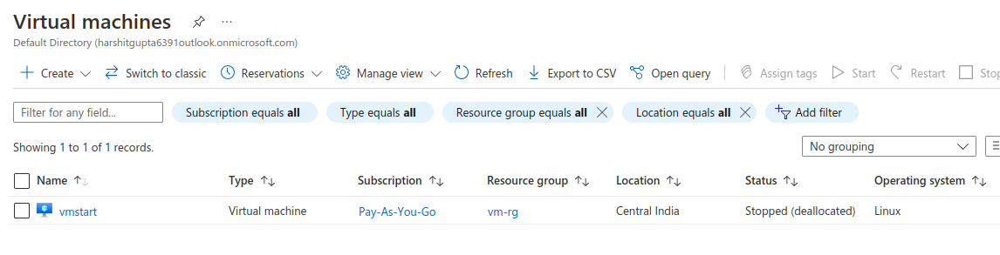
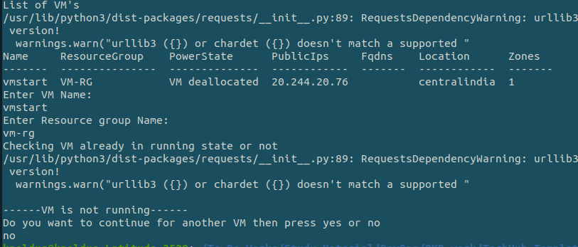

## Description

Here, In this template we will deallocate the VM of Azure using the shell script.

---
### Deallocation VM

When you stop a VM through Azure, rather than through the OS, it goes into a “Stopped (deallocated)” state. This means that any non-static public IPs will be released, but you’ll also stop paying for the VM’s compute costs. This is a great way to save money on your Azure costs when you don’t need those VMs running, and is the state that ParkMyCloud puts your VMs in when they are parked.

---

#### Pre-requisite

* AZ Account
* Azure CLI

---

### Steps:-
1. Login into AZ account using `az login` or `az login --tenant <TENANT-ID>`
2. Change the permission of the file `chmod a+x change-vm-state.sh`
3. Go to the terminal and run the command `./deallocation-VM.sh`

---

### Outputs
* Here, In this output we are deallocating VM selected from the list of VM's :

* Here, In this output we have deallocated the VM successfully:

* Before Deallocating the VM on Azure Cloud :

* After Deallocating the VM on Azure Cloud :

* Here, In this output we have entered already deallocated VM :

---
